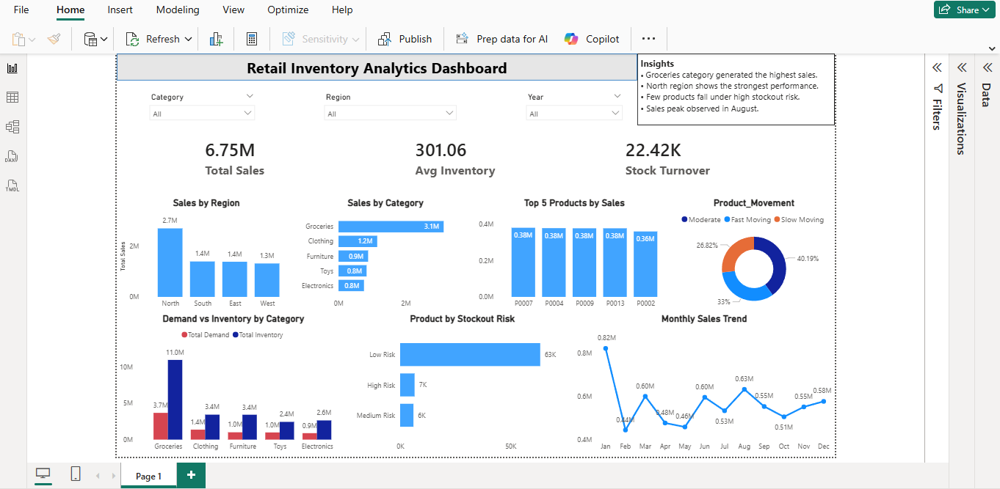

# Retail Inventory Analytics Dashboard

## Project Overview

This project analyzes retail inventory and sales data to identify product performance, stock movement, and potential stock-out risks. The dashboard helps businesses monitor sales trends and optimize inventory planning.

## Tools Used

* SQL (Data Cleaning & Analysis)
* Power BI (Dashboard Development)

## Key Metrics

* Total Sales
* Average Inventory Level
* Stock Turnover Ratio

## Dashboard Features

* Sales by Category and Region
* Top 5 Products by Sales
* Product Movement Classification
* Stock-out Risk Analysis
* Monthly Sales Trend

## Insights

* Groceries category generated the highest sales.
* North region recorded the strongest performance.
* Few products fall under high stock-out risk.
* Sales peaked during August.

## Dashboard Preview

